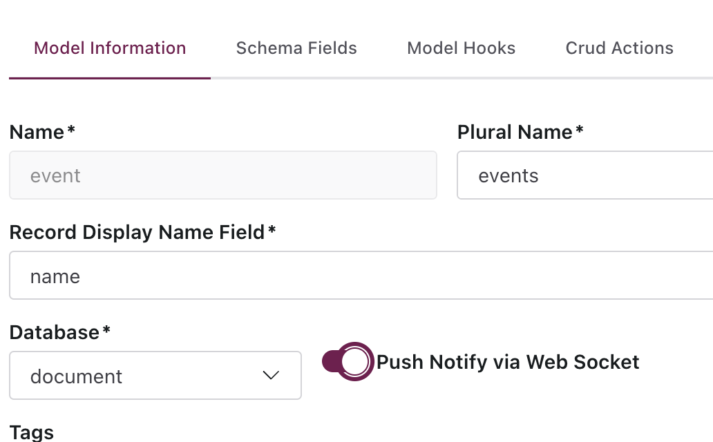

# Web Sockets
- every meta model can be optionally backed by a web socket

## Server
- Enable this feature in the admin(simple) or through the rest api(less simple).


## Client Requirements
- during the library setup we already covered the client setup but just to be sure
- If your are not using a quik start package
- Either a proxy directing all traffic from your client going to `/ws` to the Evo Server, or setting the domain of the lib using `setSocketDomain`
- [Proxy example using vite proxy](proxy.md)
- [Set Domains example](set-domains.md)

## Client
- Add the Socket Provider

*/src/App.jsx*
```
import { AuthProvider, SocketProvider, setRestDomain, setSocketDomain } from 'evo-client-lib'
import { BrowserRouter } from 'react-router-dom'
import Router from './Router'

setRestDomain('http://localhost:3030')
setSocketDomain('http://localhost:3030')

function App() {

  return (
    <BrowserRouter>
      <AuthProvider>
        <SocketProvider> 
          <Router />
        </SocketProvider>
      </AuthProvider>
    </BrowserRouter>
  )
}

export default App
```